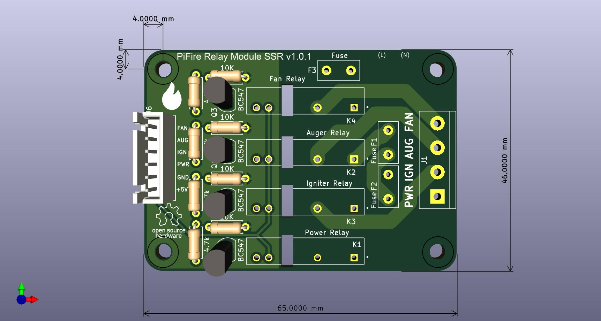
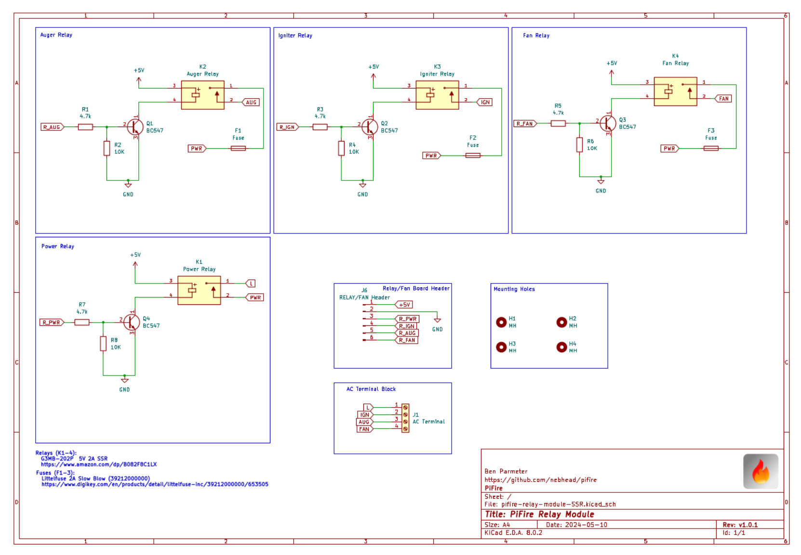

# PiFire Solid State Relay (SSR) Module PCB (v1.0.1) KiCad Files

## What is this? 

This PCB is designed to support mechanical relays for controlling incoming Power(L) to the Igniter, Auger, and AC Fan.  This board uses compact solid state relays that are able to handle high power. This is an alternative to using an off the shelf relay module which simplifies the wiring and even allows you to use the OEM harness.  

The design intent for this board was to make a DIY accessible PCB that can be more easily put together by the maker/enthusiast of almost any skill level.  Full size components are used in most cases and most (if not all) parts should be readily available to order online.  See the [Interactive BOM](#interactive-bom) for more details about the parts used and links to order.

### What is PiFire? 

PiFire is a SBC based Pellet Smoker Controller.  More details can be found [here](https://nebhead.github.io/PiFire) or [at the GitHub repo](https://github.com/nebhead/pifire). 

## What's in this Repository?

### KiCad Project Files 
In this repository you will find the latest KiCad design files for the  PCB.  Simply load the project file (.kicad_pro) into the KiCad software and you should be able to edit as needed.  Or if you just want to get this board made, jump to the production section below.

### Interactive BOM

There is an interactive BOM located in the [/bom](bom/) folder which details the parts and provides some pin information as well.  Use this to gather the components you may need to build this board out and refer back to it for placement help.    

[BOM + Pin Info](https://nebhead.github.io/pifire-relay-module-ssr)

_This is a standalone HTML file that was autogenerated by the excellent plugin for KiCad. See the plugin here: [https://github.com/openscopeproject/InteractiveHtmlBom](https://github.com/openscopeproject/InteractiveHtmlBom)_

### PDF of the Schematic

Preview the schematic in PDF format here: [Schematic](schematic.pdf)

### JLCPCB Production Files

If you wish to get these PCBs made by JLCPCB, the production files are provided in the `/production` folder.  For convenience, the file `production.zip` can simply be uploaded to JLCPCB to make it super easy to order boards.

Drop the zip file onto the order page, wait for it to upload then simply continue to order the board.  Optionally, select different board color, PCB quantity, surface finish, etc.  Most of the default settings should be sufficient. 

### Links to the PCBs in this family of PiFire Boards

This PCB is part of a family of PCBs that can be used together to create  a full PiFire system.  Generally speaking you need the Main Module/Board, a Relay Control Board and a Probe Device board to have a basic PiFire system.  

**Main Module/Board** (required)
* [Main Board v4.0.x](https://github.com/nebhead/pifire-main-module-nopwr)

**Relay/Fan Control Boards** (choose one)
* [Mechanical Relay Module](https://github.com/nebhead/pifire-relay-module)
* [Solid State Relay Module](https://github.com/nebhead/pifire-relay-module-ssr)
* [Solid State Relay + PWM Fan Module](https://github.com/nebhead/pifire-relay-pwm-module-ssr) - Coming Soon! 

**Probe Device Board** (optional)
* [ADS Board](https://github.com/nebhead/pifire-ads-board) 

### 3D Printable Enclosures/Boxes 

There aren't currently any 3D printable enclosures ready for this board.  When those are available, they will be linked here.  